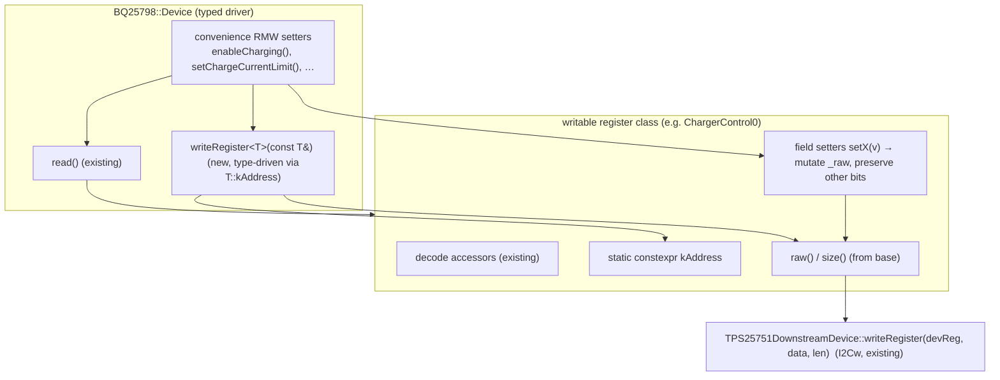

# Downstream-Device Write Path (BQ25798 typed setters / encoders) — Implementation Plan

## Context

The BQ25798 downstream-device driver tier (see
[`downstream-device.md`](downstream-device.md)) is complete and hardware-verified
for **reads**: all 57 register classes decode, `BQ25798::Device` exposes 57 typed
`read<Register>()` accessors, and the per-device factory is wired. The **write
path infrastructure already exists** but is unused at the typed level:

- `TPS25751DownstreamDevice::writeRegister(uint8_t devReg, const uint8_t* data, size_t len)`
  relays an I2Cw 4CC task (raw bytes, `len ≤ 11`, with the `Length = payload+1`
  framing and 5 s-spacing warning already handled by the proxy).
- BQ25798 register classes are **decode-only** — they have no field setters, and
  `BQ25798::Device` has no typed write API.

ADR-008 recorded "decode-only register classes + driver-side write encoders" with
the encoders **deferred**. This plan implements them: typed, field-level **write
support** for the ~30 R/W BQ25798 registers, so callers can change charge current,
voltage limits, enable/disable charging or the ADC, kick the watchdog, set masks,
etc. — with the same type-safety and symmetry the read side has.

### Decisions locked in

- **Read-modify-write value-object model.** A writable register class becomes a
  read+write value object: read the live register into the class (existing
  `read<Register>()`), mutate one or more fields via new `setX(...)` methods that
  touch only that field's bits (all other bits — including reserved — are preserved
  from the read), then write the whole register buffer back. This is the safe RMW
  pattern and needs no separate "read-current" step inside each setter.
- **Generic typed write on the driver.** `BQ25798::Device` gains
  `template<typename T> bool writeRegister(const T& reg) const`, which writes
  `reg.raw()`/`reg.size()` to `T::kAddress` via the inherited raw `writeRegister`.
  Each register class exposes `static constexpr Registers::Address kAddress` so the
  template is fully type-driven (`bq.writeRegister(*cc0)`).
- **Curated convenience setters.** For the highest-traffic single-field operations,
  `Device` also offers one-call RMW helpers (e.g. `enableCharging(bool)`,
  `setChargeCurrentLimit(uint16_t mA)`) that read → set field → write internally.
  The explicit read→mutate→write pattern remains available for everything else.
- **Read-only registers stay decode-only.** Status (1B–21), Flags (22–27), ADC
  results (31–46), ICO Current Limit (19, [R]), and Part Information (48) get no
  setters. Only the ~30 R/W registers gain encode support.
- **Same naming/namespace/factory conventions** as the read tier — no new files for
  identity/factory; setters are added to the existing class files.

### Register source of truth

Field bit positions / widths / enum values come from the **`bq25798-docs` MCP**
(`get_register` / `explain_bitfield`). **Inverse** engineering-unit encodings reuse
the exact LSB/offset constants already established on the read side (e.g.
ChargeCurrentLimit 10 mA/LSB, VotgRegulation 10 mV/LSB +2800 mV, VSYSMIN 250 mV/LSB
+2500 mV) — read each class's existing decode accessor and invert it, so encode and
decode can never disagree. ADC-result registers are read-only, so no ADC LSB
encoding is needed.

## Architecture



Dependency order: **L1 write primitives → L2 per-class field setters → L3 driver
convenience setters → L4 examples/docs.**

## L1 — Write primitives (base + proxy + driver)

- **`include/TPS25751Register.h`** — add two public accessors to the device-agnostic
  base so any class can be written back:
  `const uint8_t* raw() const { return _raw; }` and `size_t size() const { return _len; }`.
  (Read-only addition; host classes are unaffected.)
- **`include/BQ25798/BQ25798Encode.h`** (new) — small `namespace BQ25798` header of
  `inline` field-encode helpers so the bit math lives in one place instead of being
  re-derived in ~150 setters. Mirrors the decode side's manual big-endian rule:
  - `inline void setField8(uint8_t* raw, uint8_t bitPos, uint8_t bitLen, uint8_t value)`
    — `raw[0] = (raw[0] & ~mask) | ((value << bitPos) & mask)` for 1-byte registers.
  - `inline void setField16BE(uint8_t* raw, uint8_t bitPos, uint8_t bitLen, uint16_t value)`
    — assemble `v = (raw[0]<<8)|raw[1]`, `v = (v & ~mask) | ((value<<bitPos) & mask)`,
    then split **big-endian** `raw[0]=v>>8; raw[1]=v&0xFF`. (Matches the read side's
    `(raw[0]<<8)|raw[1]` convention — do NOT use a little-endian helper.)
  Each helper masks `value` to the field width (silent clamp); document that.
- **`include/BQ25798/BQ25798Device.h` / `.cpp`** — add the generic typed write:
  ```cpp
  template<typename T>
  bool writeRegister(const T& reg) const {
      return TPS25751DownstreamDevice::writeRegister(
          static_cast<uint8_t>(T::kAddress), reg.raw(), reg.size());
  }
  ```
  Plus a read-modify-write helper used by the convenience setters (L3):
  ```cpp
  // read T, apply mutator, write back; returns false on any I/O failure
  template<typename T, typename F>
  bool updateRegister(F&& mutate) const;   // reads via read<T>(false), calls mutate(*reg), writeRegister(*reg)
  ```
  (`updateRegister` keeps the explicit pattern DRY without `std::function` — a small
  template; if the toolchain balks at the callable, fall back to explicit setters.)

## L2 — Per-class field setters (the bulk; mirror the decode accessors)

For each **R/W** register class, add — alongside the existing decode accessors —
`static constexpr Registers::Address kAddress = Registers::Address::<NAME>;` and a
field setter per writable field, using the L1 encode helpers:

- Single-bit fields → `void setEnChg(bool on)` → `setField8(_raw, 5, 1, on ? 1 : 0)`.
- Enum fields → `void setWatchdog(Watchdog v)` → `setField8(_raw, 0, 3, static_cast<uint8_t>(v))`.
- Numeric (engineering-unit) fields → `void setMilliamps(uint16_t mA)` → encode
  `code = mA / kLsbMa` (invert the existing decode constant) then `setField16BE`/`setField8`.
- Self-clearing command bits (REG_RST, WD_RST, FORCE_ICO, FORCE_INDET, FORCE_IBATDIS,
  FORCE_VINDPM_DET, BKUP_ACFET1_ON, REG0A is normal) get a plain `setX(bool)` too.

Setters mutate `_raw` only; they never touch reserved bits, so a value object that
was populated by `read<Register>()` round-trips safely. Guard with `if (!isValid()) return;`.

**Writable registers (~30) by group:**
- **Charge limits:** MinimalSystemVoltage(00), ChargeVoltageLimit(01), ChargeCurrentLimit(03),
  InputVoltageLimit(05), InputCurrentLimit(06), VotgRegulation(0B), IotgRegulation(0D).
- **Thresholds:** PrechargeControl(08), TerminationControl(09), RechargeControl(0A).
- **Charger Control:** ChargerControl0–5 (0F–14).
- **Timing/behavior:** TimerControl(0E), MpptControl(15), TemperatureControl(16),
  NtcControl0(17), NtcControl1(18).
- **ADC config:** AdcControl(2E), AdcFunctionDisable0(2F), AdcFunctionDisable1(30).
- **Masks:** ChargerMask0–3 (28–2B), FaultMask0(2C), FaultMask1(2D).
- **DPDM:** DpdmDriver(47).

(ICO Current Limit (19) is [R] despite being in the "limits" cluster — no setters.)

## L3 — Driver convenience setters (curated, one-call RMW)

On `BQ25798::Device`, add high-value one-call helpers wrapping
`updateRegister<T>` (read → set field → write). Curated, not exhaustive — the
generic `writeRegister<T>` + class setters cover the rest:

```cpp
bool enableCharging(bool on);                 // ChargerControl0 EN_CHG
bool enableHiz(bool on);                       // ChargerControl0 EN_HIZ
bool enableADC(bool on);                        // AdcControl ADC_EN
bool kickWatchdog();                            // ChargerControl1 WD_RST (self-clearing)
bool setWatchdog(ChargerControl1::Watchdog v);  // ChargerControl1 WATCHDOG_2:0
bool setChargeCurrentLimit(uint16_t milliamps); // ChargeCurrentLimit ICHG
bool setChargeVoltageLimit(uint16_t millivolts);// ChargeVoltageLimit VREG
bool setInputCurrentLimit(uint16_t milliamps);  // InputCurrentLimit IINDPM
bool setInputVoltageLimit(uint16_t millivolts); // InputVoltageLimit VINDPM
bool enableOTG(bool on);                        // ChargerControl3 EN_OTG
```

Each returns `false` if the underlying read or write fails.

## Prioritization — two implementation phases

**Phase 1 (high-value control surface):** the L1 primitives, then setters +
`kAddress` for **ChargerControl0, ChargerControl1, AdcControl, ChargeCurrentLimit,
ChargeVoltageLimit, InputCurrentLimit, InputVoltageLimit, MinimalSystemVoltage,
PrechargeControl, TerminationControl**, and the full L3 convenience-setter set above.

**Phase 2 (remaining R/W registers):** setters + `kAddress` for ChargerControl2–5,
RechargeControl, VotgRegulation, IotgRegulation, TimerControl, MpptControl,
TemperatureControl, NtcControl0/1, AdcFunctionDisable0/1, ChargerMask0–3,
FaultMask0/1, DpdmDriver.

## Files touched

- **`include/TPS25751Register.h`** — add `raw()` / `size()` accessors.
- **`include/BQ25798/BQ25798Encode.h`** — **new** encode helpers.
- **`include/BQ25798/BQ25798Device.{h,cpp}`** — `writeRegister<T>`, `updateRegister<T>`,
  L3 convenience setters.
- **`include/BQ25798/BQ25798<Reg>.{h,cpp}`** — for each ~30 R/W register: `kAddress`
  + field setters (decode accessors untouched).
- **`examples/bq25798-charge-config/`** (or a new `examples/bq25798-set-charge/`) —
  add a guarded write demo (read → set → write → read-back verify).
- **Docs:** `AGENTS.md`, `docs/engineering/{ARCHITECTURE.md (extend ADR-008 /
  Register Write Flow), STANDARDS.md (write-encoder pattern + RMW rule),
  CONSTRAINTS.md (I2Cw cap/Length framing already documented — add the
  read-modify-write-to-preserve-reserved-bits rule), CODE_REVIEW_GUIDELINES.md
  (encode big-endian + invert-decode-constant + RMW traps)}`.

## Documentation updates

- **ARCHITECTURE.md:** extend **ADR-008** (or add **ADR-009 "Downstream write
  encoders"**) recording the RMW value-object model + generic `writeRegister<T>`;
  flesh out the *Register Write Flow* section with the read→mutate→write path.
- **STANDARDS.md:** add the write-encoder template (field setters mirror decode
  accessors; `kAddress`; never touch reserved bits; mask to field width) and the
  **invert-the-decode-constant** rule (encode reuses the class's own LSB/offset).
- **CONSTRAINTS.md / CODE_REVIEW_GUIDELINES.md:** RMW-to-preserve-reserved-bits;
  big-endian field placement on encode; I2Cw `len ≤ 11` and `Length = payload+1`
  (already there) apply; self-clearing command bits read back 0.

## Execution strategy (fan-out/fan-in + model split)

Sonnet subagents implement; **Opus is the quality gate** (this session). Same
structure as the read tier, scaled to the smaller write surface.

1. **Stage 1 — primitives + reference (1 Sonnet agent, serial).** Add base
   `raw()`/`size()`; create `BQ25798Encode.h`; add `writeRegister<T>` +
   `updateRegister<T>` to `Device`; fully implement **ChargerControl0** as the
   reference writable class (`kAddress` + all bit setters) and **one** L3
   convenience setter (`enableCharging`) end-to-end; add a guarded write example;
   build (`cd ../.. && pio run`) green to lock the encode contract + setter style.
2. **Stage 2 — parallel setter groups (N Sonnet agents, Phase 1 then Phase 2).**
   Each owns a disjoint group of writable classes and adds `kAddress` + field
   setters ONLY to those class files (no edits to Device/Encode/base), copying the
   ChargerControl0 reference and inverting each class's existing decode constants.
   Groups mirror the read tier's clusters (Charge-limits, Thresholds, Control,
   Timing, ADC-config, Masks, DPDM). No builds in parallel (shared-tree race).
3. **Stage 3 — integration (1 Sonnet agent, serial).** Add the remaining L3
   convenience setters on `Device`; finish the write example(s); build and fix.
4. **Opus review gate (this session).** `/code-review` at **high** effort on the
   correctness-sensitive surface: encode big-endian field placement, **inverse unit
   conversions match the decode side**, reserved bits preserved under RMW, field
   masking/clamping, `kAddress` correctness, self-clearing-bit semantics, and the
   I2Cw `len ≤ 11` / `Length = payload+1` framing. Opus applies fixes directly.
5. **Re-verify** build (parent-project `pio run`) before done.

## Verification

No unit-test harness exists; verify by build + non-destructive hardware round-trip:

1. **Build** from the parent project: `cd ../.. && pio run` (Teensy 4.0) — green
   confirms the encode helpers, setters, `kAddress`, and the write templates.
2. **RMW round-trip (non-destructive):** pick a benign, reversible field (e.g.
   `AdcControl::ADC_EN`, or set `ChargerControl1` WATCHDOG to a new valid code).
   `read<T>()` → assert other fields unchanged in the buffer → `setX(newValue)` →
   `writeRegister(*reg)` → `read<T>()` again → assert the field changed and the
   **reserved + sibling fields are unchanged**. Restore the original value.
3. **Logic-analyzer check:** capture the I2Cc bus and confirm the I2Cw transaction
   carries `{addr, Length=payload+1, regOffset, payload…}` with the expected bytes,
   and that a 2-byte write places the **high byte first** (big-endian).
4. **Convenience setters:** exercise `setChargeCurrentLimit(mA)` then read back
   `ChargeCurrentLimit::milliamps()` and confirm it equals the requested value
   rounded to the 10 mA LSB.
5. **Avoid destructive operations** during bring-up: do not issue `REG_RST`, ship/
   shutdown modes (`SDRV_CTRL`), or anything that cuts system power; keep a known-good
   charge configuration restorable.
