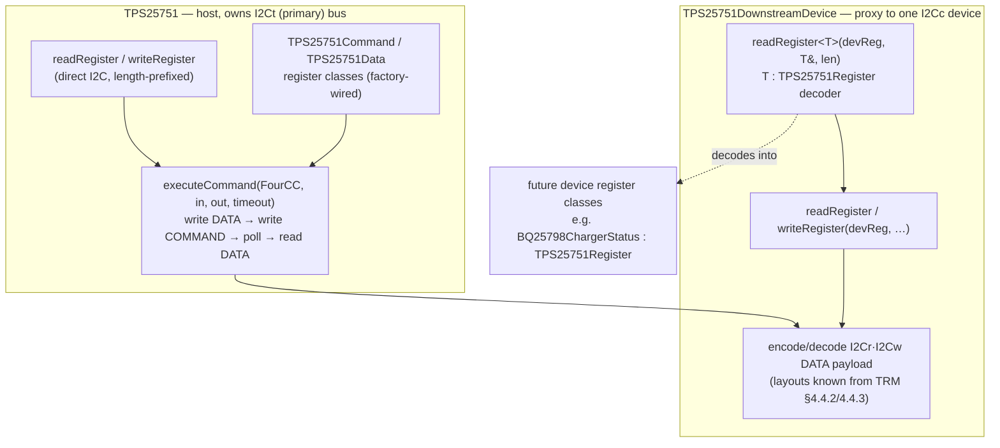

# I2Cr / 4CC Command-Task Infrastructure + Downstream-Device Abstraction (TRM §4.4.2)

## Context

The TPS25751 reaches downstream I2C devices on its secondary bus (I2Cc_SDA/SCL) by acting
as an I2C *controller*. It does this through a **4CC command interface**: write input bytes
to **DATA** (`0x09`, 64 B), write a 4-char ASCII code to **COMMAND** (`0x08`, 4 B), the
controller runs the task, then **clears COMMAND to 0** on success or replaces it with `!CMD`
if unrecognized; results read back from DATA. The **I2Cr** (read) and **I2Cw** (write) tasks
carry a target device address + byte counts + bytes in the DATA payload — this is how the
host proxies register access to parts like the **BQ25798 charger** wired to I2Cc.

Today the library is **read-only**: `TPS25751` has only `readRegister(...)` (`src/TPS25751.cpp:19`);
no write path exists; COMMAND/DATA are addresses (`include/TPS25751RegisterAddress.h:18-19`,
sizes 4/64 at lines 64-65) with no register classes (factory returns `nullptr`). The 15
existing registers follow a uniform pattern: a class extending the device-agnostic decoder
`TPS25751Register` (raw bytes + `extractBits*`), wired into `TPS25751RegisterFactoryImpl` by
`Address`, with three-tier validation and `debugPrint()`.

**Decided scope (per discussion):** build the *foundation* (register write path, COMMAND/DATA
register classes, generic 4CC executor) **and** the *downstream-device abstraction* that mirrors
the existing register pattern for parts on I2Cc — so device register classes (e.g. BQ25798)
can be added later exactly the way TPS25751 registers are today. The I2Cr/I2Cw DATA byte layouts are
known from TRM §4.4.2/4.4.3 (provided), so the codec ships complete this change. No concrete downstream
device (BQ25798) ships here — only the abstraction it will plug into.

## Architecture



Dependency order for implementation: **L1 write path → L2 Command/Data classes → L3 executor →
L4 downstream device**. The demo comes last.

## L1 — Register write support (mirror the read path)

The custom protocol is length-prefixed both ways: reads `requestFrom(len+1)` discarding a
leading byte-count (`src/TPS25751.cpp:31-55`); writes send `[regAddr][byteCount][data…]`. Add,
mirroring the read overloads (`include/TPS25751.h:62-63,267`, `src/TPS25751.cpp:149-162`):

- **private** `bool writeRegister(uint8_t regAddr, const uint8_t* data, size_t length) const;` —
  `beginTransmission(_address)` → `write(regAddr)` → `write((uint8_t)length)` → `write(data,length)`
  → `endTransmission(true)`. Verify the `write(data,length)` return `== length` and
  `endTransmission()==0`; route failures through `TPS_REPORT_I2C_ERROR` / `TPS_DEBUG_*` exactly as
  the read path.
- **public** `bool writeRegister(TPS25751Registers::Address addr, const uint8_t* data, size_t length) const;`
  — same size guard as `TPS25751.cpp:154-160` (`expectedSize!=0 && expectedSize!=length` → fail), delegate.
- **public** `bool writeRegister(TPS25751Registers::RegisterInfo regInfo, const uint8_t* data) const;`

## L2 — COMMAND/DATA register classes (symmetry with the 15)

Follow the standard register checklist (extend `TPS25751Register`; three-tier validation;
`debugPrint()` with `F()`; factory `case` by `Address`). New files mirror e.g.
`include/TPS25751PowerStatus.h` + `src/TPS25751PowerStatus.cpp`:

- `include/TPS25751Command.h` / `src/TPS25751Command.cpp` — `class TPS25751Command : public TPS25751Register`
  (4 B). Accessors: `fourCC()` (the 4 chars), `isClear()` (all-zero), `isRejected()` (== `"!CMD"`),
  `debugPrint()`. `isSemanticallyValid()` = clear, a printable 4CC, or `!CMD`.
- `include/TPS25751Data.h` / `src/TPS25751Data.cpp` — `class TPS25751Data : public TPS25751Register`
  (64 B). Generic byte/`extractBits*` access + hexdump `debugPrint()`.
- **Wire into the factory** (`include/TPS25751RegisterFactory.h` + `src/TPS25751RegisterFactory.cpp`):
  forward-decls, `createCommandRegister`/`createDataRegister` (both overloads), add `case COMMAND`/`case DATA`
  to all three `createRegister` switches, add `#include`s. `getRegisterInfo`/`getRegisterSize` already
  cover COMMAND/DATA.
- For full symmetry, add `readCommandRegister(bool validate=true)` / `readDataRegister(...)` convenience
  methods on `TPS25751` returning `std::unique_ptr<...>` (pattern of `readPowerStatusRegister`,
  `src/TPS25751.cpp:298-307`).

## L3 — Generic 4CC executor

New value types in **`include/TPS25751Task.h`** (header-only/constexpr; kept separate so
`TPS25751Command.h` stays one-class-per-file like its siblings):

- `struct TPS25751FourCC { char code[4]; };` + `constexpr` `of("I2Cr")` factory. First char in the
  lowest byte → COMMAND bytes `{'I','2','C','r'}`. Constants `CMD_CLEAR{0,0,0,0}`, `CMD_REJECTED=of("!CMD")`.
- `enum class TPS25751TaskStatus : uint8_t { Success, Rejected, Timeout, I2CError };`
- `struct TPS25751TaskResult { TPS25751TaskStatus status; uint8_t returnCode; };` (`returnCode` = first
  DATA byte post-completion = TI task return code; unparsed here).

Executor on `TPS25751` (`TPS25751.h` decl, `TPS25751.cpp` impl):

```cpp
TPS25751TaskResult executeCommand(
    TPS25751FourCC cmd,
    const uint8_t* inData = nullptr, size_t inLen = 0,
    uint8_t*       outData = nullptr, size_t outLen = 0,
    uint32_t timeoutMs = 200) const;
```

1. If `inData`, write it to DATA via the **private raw** `writeRegister(uint8_t,…)` with exact `inLen`
   — the public `Address` overload's guard requires `length==64` for DATA and would reject short payloads;
   `executeCommand` is a member so it has access to the private overload.
2. Write `cmd.code` to COMMAND via `writeRegister(Address::COMMAND, cmd.code, 4)`.
3. **Poll** COMMAND with `readRegister(Address::COMMAND, buf, 4)`; decode each read by constructing a
   `TPS25751Command(buf,4)` and checking `isClear()` → `Success` / `isRejected()` → `Rejected`
   (reuses L2). `millis()-start > timeoutMs` → `Timeout`; ~5 ms inter-poll `delay`; any I/O failure → `I2CError`.
4. On `Success`, read the full 64-B DATA into a local buffer via the **private raw**
   `readRegister(uint8_t,buf,64)` (exact register size — avoids partial-read ambiguity), set
   `returnCode=buf[0]`, and if `outData` `memcpy(outData, buf, min(outLen,64))`. Note `outData`
   mirrors DATA **from byte 0** (so `outData[0]` is the task return code); task-specific layout
   (e.g. I2Cr's read bytes starting at DATA[1]) is unpacked by the caller in L4, keeping the
   executor task-agnostic.

Add `#define DEBUG_CAT_TASK 0x10` to `include/TPS25751Debug.h` (next bit after `DEBUG_CAT_PARSING 0x08`);
use it in executor + downstream logs.

**Async/IRQ — deferred (decided).** Completion detection here is the ~200 ms busy-poll on COMMAND only.
An interrupt-driven path (optional `irqPin` on the `TPS25751` constructor; ISR sets a volatile flag on
`cmd1Complete` (INT_EVENT1 bit 30) so the executor waits on the flag instead of polling, then reads
INT_EVENT1 for the result + `i2cControllerNacked` (bit 82) and clears via INT_CLEAR1) is a **follow-up**,
not part of this change. Rationale: per TRM the 5 s spacing is a fixed minimum between consecutive
same-type commands and the IRQ most likely does **not** waive it — so the async path is a latency/CPU
optimization, not a 5 s fix, and isn't worth its ISR/INT_EVENT1/INT_CLEAR1 complexity until the downstream
path is proven on hardware. To keep that wrapper cheap to add later, isolate the poll loop in
`executeCommand` behind a single private `waitForCommandClear(uint32_t timeoutMs)` helper that an IRQ-based
variant can replace without touching the encode/decode or DATA staging logic.

## L4 — Downstream-device abstraction (the I2Cc analog of `TPS25751`)

New `include/TPS25751DownstreamDevice.h` / `src/TPS25751DownstreamDevice.cpp` — a class that is, for a
device on I2Cc, what `TPS25751` is for its own registers. The DATA layouts are now known from TRM
§4.4.2/4.4.3 (DATA is 0-indexed below; table "Byte 1" = DATA[0]):

- **I2Cr input** (3 B): `DATA[0]`=target addr (7-bit, bit7 reserved=0), `DATA[1]`=register offset,
  `DATA[2]`=NumBytes to read. **Output:** `DATA[0]`=task return code, `DATA[1..NumBytes]`=bytes read
  (so read data starts at **offset 1**; max 64 read bytes).
- **I2Cw input** (4 + payload B): `DATA[0]`=target addr, `DATA[1]`=payload length, `DATA[2]`=reserved(0),
  `DATA[3]`=register offset, `DATA[4..]`=payload. **Max payload = 10 bytes** (DATA bytes 5-14; anything
  past byte 14 is ignored). **Output:** `DATA[0]`=task return code (success only means the write was
  *queued*, not completed on the wire).

```cpp
class TPS25751DownstreamDevice {
public:
    TPS25751DownstreamDevice(const TPS25751& host, uint8_t deviceAddress);
    bool readRegister(uint8_t devReg, uint8_t* buf, size_t len) const;          // via I2Cr (len <= 64)
    bool writeRegister(uint8_t devReg, const uint8_t* data, size_t len) const;  // via I2Cw (len <= 10)
    template<typename T>                                                        // typed decode,
    bool readRegister(uint8_t devReg, T& out, size_t len) const {              // mirrors TPS25751::readRegister<T>
        uint8_t buf[64];
        if (len > sizeof(buf) || !readRegister(devReg, buf, len)) return false;
        out = T(buf, len); return true;                                        // T : TPS25751Register
    }
private:
    const TPS25751& _host;
    uint8_t _deviceAddress;
    mutable uint32_t _lastI2CrMs, _lastI2CwMs;   // enforce TRM 5 s spacing (see below)
};
```

- `readRegister`: bounds-check `len<=64`; build `in={addr, devReg, (uint8_t)len}`; pass a local
  `uint8_t raw[64]` as `outData` with `outLen=64` to `executeCommand(FourCC::of("I2Cr"), in,3, raw,64)`;
  on `Success && returnCode(raw[0])==0`, `memcpy(buf, raw+1, len)` (data lives at DATA offset 1).
- `writeRegister`: bounds-check `len<=10`; build `in={addr, (uint8_t)len, 0, devReg, data…}` (4+len bytes);
  `executeCommand(FourCC::of("I2Cw"), in, 4+len)`; success = `status==Success && returnCode==0` (queued).
  (The "Length" field is set to the payload byte count; confirm against a logic-analyzer capture since the
  TRM wording leaves whether it counts the register-offset byte mildly ambiguous.)
- **5 s spacing constraint (TRM):** consecutive `I2Cr` commands — and consecutive `I2Cw` commands — must be
  ≥5 s apart. This is *host pacing*, separate from the executor's ~200 ms completion poll. Track
  `_lastI2Cr/wMs` via `millis()` and, if a call arrives too soon, emit a `DEBUG_CAT_TASK` warning (do not
  silently hard-block — caller may manage timing); document it prominently in the header and demo.
- **Device register classes** (future: `BQ25798ChargerStatus`, etc.) extend the existing device-agnostic
  decoder `TPS25751Register` — same base, same `extractBits*`/validation/`debugPrint()` as the 15 TPS25751
  classes — read via `device.readRegister<BQ25798ChargerStatus>(reg, out, len)`. This gives the requested
  flexibility to model downstream registers as classes, symmetric with the host side, without a per-device
  factory in this change. With the layouts now known, the codec ships complete (no deferred seam).

## Files touched

- `include/TPS25751.h`, `src/TPS25751.cpp` — write overloads, `executeCommand`, `readCommand/DataRegister`.
- `include/TPS25751Command.h` + `src/TPS25751Command.cpp` — **new** register class.
- `include/TPS25751Data.h` + `src/TPS25751Data.cpp` — **new** register class.
- `include/TPS25751Task.h` — **new** `TPS25751FourCC` / status / result.
- `include/TPS25751RegisterFactory.h` + `src/TPS25751RegisterFactory.cpp` — wire COMMAND/DATA.
- `include/TPS25751DownstreamDevice.h` + `src/TPS25751DownstreamDevice.cpp` — **new** abstraction + I2Cr/I2Cw codec seam.
- `include/TPS25751Debug.h` — `DEBUG_CAT_TASK 0x10`.
- `examples/teensy-read-registers/src/main.cpp` — smoke-test call (this is the example that builds via the parent project).
- `docs/engineering/*` + root `AGENTS.md` — documentation updates (see the Documentation phase below).

## Documentation updates (`docs/engineering/`)

Treat this as its own phase, done alongside the code (docs are part of the definition of done per
DOCUMENTATION.md / the register checklist). Targeted edits to the existing sections:

- **CONSTRAINTS.md**
  - `TPS25751 Custom I2C Protocol` (§171) + new content under `Write-Only` / `Read/Write Registers`
    (§276/§306): document the **write framing** `[regAddr][len][data…]` now that a real write path exists.
  - `Maximum Read Sizes` (§230): add a **4CC Command Interface & I2Cc proxy** subsection — COMMAND clears
    to 0 on success / `!CMD` on reject; DATA is 64 B; **I2Cr** input `{addr,reg,nbytes}` with read data at
    **DATA offset 1** (max 64 B); **I2Cw** input `{addr,len,0,reg,payload…}` (**payload ≤10 B**, ignored past
    byte 14); and the **5 s minimum spacing** between consecutive same-type commands. Add target-address is
    7-bit (mask bit 7) to `Common Pitfalls`.
- **ARCHITECTURE.md**
  - `Layer Responsibilities` (§61) + `Core Components` (§102): add the **4CC command layer** and the
    **I2Cc downstream-proxy layer**; document `TPS25751Command`/`TPS25751Data`, `TPS25751Task`
    (`FourCC`/status/result), and `TPS25751DownstreamDevice`.
  - `Inheritance Tree` (§504): add the two new register classes and note **downstream device register
    classes reuse `TPS25751Register`** as their decoder base.
  - `Register Write Flow` (§601): flesh out this (currently forward-looking) section with the real
    `writeRegister` path and the `executeCommand` DATA→COMMAND→poll→DATA handshake.
  - `Extension Points` (§650): add **"Adding a downstream device driver"** (compose `TPS25751DownstreamDevice`
    + register classes extending `TPS25751Register`).
  - `Future Architecture Considerations` (§835) + new **ADR-007**: record the 4CC/I2Cc-proxy architecture as
    accepted, and the **interrupt-driven async path as deferred** (with the 5 s-spacing rationale from above).
- **STANDARDS.md**: in `Factory Integration` (§111) / `Class Structure` (§29), note COMMAND/DATA now have
  classes and that `TPS25751Data` is a generic 64-B register (hexdump `debugPrint`, minimal semantic
  validation); state that downstream-device register classes follow the same mandatory template.
- **TESTING.md**: add required cases under `Round-Trip R/W Testing` (§546) and `Hardware Testing` (§577):
  write-path framing, executor reject path (`!CMD`), I2Cr/I2Cw encode/decode round-trip (incl. offset-1
  read + ≤10 B write), and a hardware check of the I2Cc proxy + 5 s spacing.
- **CODE_REVIEW_GUIDELINES.md**: extend `Platform-Specific Correctness` / `Hard-to-Notice Bugs` with the
  task-specific traps — 7-bit target masking, I2Cr read data at DATA offset 1, I2Cw payload ≤10 B, write
  length byte, and 5 s spacing.
- **AGENTS.md** (root; `CLAUDE.md` is a symlink — edit AGENTS.md): bump the implemented-register count for
  COMMAND/DATA and add the new classes to the component/register lists.

## Execution strategy (model split)

Implementation is delegated to Sonnet with Opus as the quality gate — encoded here so the harness
follows it without a manual `/model` switch:

1. **Sonnet implementation subagent.** Spawn **one** `general-purpose` subagent with `model: sonnet`,
   given this plan file path and pointed at `AGENTS.md` + `docs/engineering/STANDARDS.md`/`CONSTRAINTS.md`.
   It executes the full plan in dependency order (**L1 → L2 → L3 → L4 → demo → docs**) in a single run
   (one agent, not per-phase, to avoid integration drift across the tightly-coupled executor/codec files).
   It must honor the platform rules: `static_cast` only (no RTTI), `F()` for flash strings, the I2C
   length byte, three-tier validation + `debugPrint()` on the new register classes, and factory wiring by
   `Address`. It builds via the parent PlatformIO project (`cd ../.. && pio run`) and reports results.
2. **Opus review gate (this session).** After the subagent returns, run `/code-review` at **high** effort
   focused on the correctness-sensitive surface: I2Cr read data at **DATA offset 1**, 7-bit target masking,
   I2Cw payload ≤10 B + length byte, the write framing, the `executeCommand` poll/timeout logic, and the
   5 s spacing guard. Opus applies the fixes directly (these are the spots least suited to Sonnet).
3. **Re-verify** the build after fixes (parent-project `pio run`) before considering it done.

## Verification

No unit-test harness exists (TESTING.md is aspirational). Verify by build + non-destructive on-hardware probe:

1. **Build** from the parent PlatformIO project: `cd ../.. && pio run` (Teensy 4.0). Green compile confirms
   the write path, Command/Data classes, executor, and downstream types.
2. **Smoke test (no external device, no side effects):** from `setup()`, call
   `executeCommand(TPS25751FourCC::of("!XYZ"))` (deliberately invalid 4CC) and assert `Rejected` — exercises
   COMMAND write, poll loop, and `!CMD` read-back end-to-end. `pio run -t upload`, watch `pio device monitor` @115200.
3. **Downstream path:** point a `TPS25751DownstreamDevice` at a real I2Cc part (e.g. BQ25798), read a
   known-value register (e.g. a part-ID register), and compare to a logic-analyzer capture of the I2Cc bus —
   this also confirms the I2Cw "Length" interpretation and the 5 s spacing behavior.

Avoid destructive 4CCs (e.g. `GAID` cold reset) during bring-up.